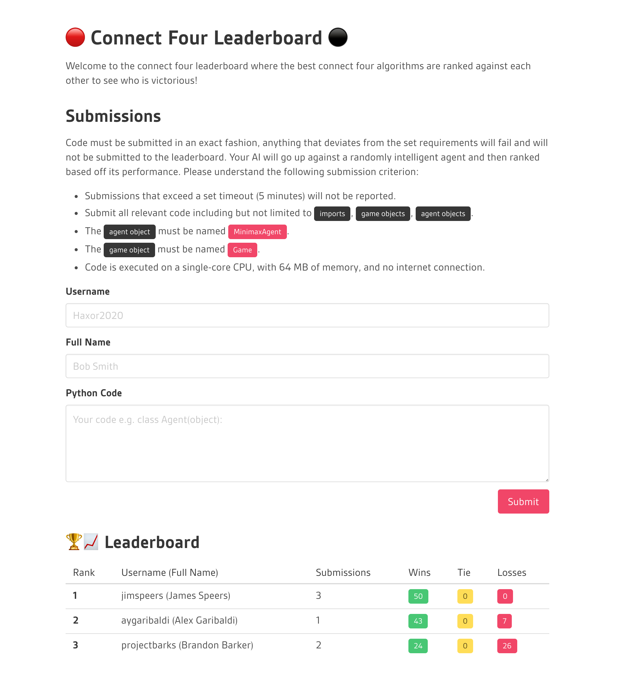

# Connect 4 Leaderboard

A simple connect four leaderboard that runs the benchmarks in a dockerized container for security and standardization.

## Screenshot


## Setup & Running
### Installation
1. Install docker for your specific system
1. Install postgres
1. Import table template into database *(todo)*
1. Update `.env` with relevant changes
1. Pull the relevant docker image intended or use the same image listed in `.env`
1. Activate and create a virtual environment
1. Install requiurements `pip install -r requirements.txt`

### Execution
1. Running the server: `./run-server.sh`
1. Running the tournament cron job `./run-tournament.sh`

## Base Code
```python
class Game(object):
    pass


class MinimaxAgent(object):
    """Smart agent -- uses minimax to determine the best move"""
    
    def __init__(self, color: str):
        """Agents use either RED (R) or BLACK (B) chips."""
        pass

    def move(self, game: Game) -> Game:
        """Returns the best move using minimax as a new game instance"""
        # YOU FILL THIS IN
        pass

```

## Todo
- [ ] **Add Match Cache** - When recomputing the matches check which users have increased their submission count and only
                            redo matches for those players. This would not dramatically decrease computation but could be
                            substantial in cases where only one or two players are modifying their code between execution. 
- [ ] **Dojo** - Allow players who submit their code to run in a 1v1 fashion playing back the results in realtime with a
                 dramatic effect. It could also permit benchmarking against competitive agents before a total re-computation.
- [ ] **Hash Passcodes** - The fact passcodes are not encrypted right now is a huge security risk. All passcodes
                            should be encrypted and a bash script should be created to reset passcodes. 
- [ ] **Game Limits** - There is the possibility for a player to capitalize on the time and memory against the other agent.
                        To create fair play both players should be in their own docker instances with shared communication.
                        The simplest current addition to the existing infrastructure would be to give an instant win to the 
                        agent who took less time.
- [ ] **Duration Ordering** - Agents with identical win rates should be ordered by least amount of time taken to win as a
                              secondary sort component. 

## License 
[MIT License](./LICENSE)